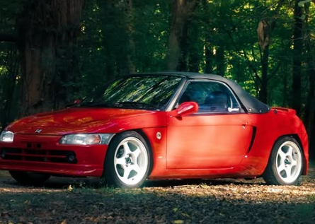

# Hanna's Beat

A little website I made for Hanna's awesome Honda Beat. It has pictures of her car and her two cats (Ahna and Blu), mod ideas (performance, cosmetic, cute stuff and cat stuff) with pictures and rough prices, a few themed looks you can add in one click, parts for sale that ship to the US, a list of every site I found that sells Beat parts, and Honda Beat news. There's also a list where you can add stuff and check it off.

It runs on your own computer, nothing is hosted anywhere.



## Running it

You need [Node.js](https://nodejs.org) installed (the LTS version). That's the only thing. No `npm install` or anything.

**Windows:** double click `Start.bat`. It opens the site in your browser. Leave the black window open while you're using it, close it when you're done.

If Node isn't installed, `Start.bat` will open the download page for you.

**Mac / Linux:** open a terminal in this folder and run

```
npm start
```

The site runs at http://localhost:1991 (1991 because that's when the Beat came out).

## Parts for sale

The parts section pulls from two places:

- **PP1 Beat** ([pp1beat.com](https://pp1beat.com)), a store just for Beats in Toronto that ships to the US with no duties. This works right away, no setup.
- **eBay**, only sellers located in the US that ship in the US. This needs a free key (below).

### Connecting eBay

eBay uses its official API, which needs a free key. You only do this once:

1. Go to [developer.ebay.com](https://developer.ebay.com), sign in with any eBay account and join the developer program. It's free.
2. Open **Application Keys** and create a **Production** keyset.
3. Still on Application Keys, click **Notifications** next to the Production keyset. With **Marketplace Account Deletion** selected, turn on **Exempted from Marketplace Account Deletion**, pick **I do not persist eBay data** and submit. Leave the email, endpoint and token boxes empty. If you skip this, eBay marks the keyset **Non Compliant** and turns it off. (It's true for this site, it only saves item info like titles, prices and photos, never anything about eBay users.)
4. Start the site and paste the **App ID** and **Cert ID** into the box in the "Parts for sale" section. You can add a zip code too so it shows real shipping prices.

The keys get saved to `data/ebay.json` on your computer. That file is gitignored so it never ends up on GitHub. You can also set `EBAY_CLIENT_ID` and `EBAY_CLIENT_SECRET` as environment variables instead if you'd rather.

Without a key everything else still works, and every mod has links to search eBay and the other shops.

## Where to buy

There's a section with every site I found that sells Beat parts, with where they ship from:

| Site | Where | Good for |
| --- | --- | --- |
| [eBay](https://www.ebay.com) | US sellers | Pretty much everything |
| [PP1 Beat](https://pp1beat.com) | Toronto, ships to the US with no duties | Maintenance parts, a couple of exhausts |
| [EtsuRyu](https://www.etsuryu.com/product-category/honda/pp1-beat) | Japan, ships internationally | Kei car kits and rare stuff |
| [Nengun](https://www.nengun.com/honda/beat-pp1-110) | Japan, ships to the US | Aftermarket and genuine Honda |
| [RHDJapan](https://www.rhdjapan.com/search?q=honda+beat) | Japan, ships worldwide | Exhaust, suspension, aero |
| [Amayama](https://www.amayama.com/en/genuine-catalogs/honda/beat) | Japan / UAE | Genuine Honda parts |
| [Redline360](https://shop.redline360.com/search?q=honda+beat) | US | CUSCO strut bar |
| [Etsy](https://www.etsy.com), [Amazon](https://www.amazon.com) | US | Stickers and cosmetic stuff |
| [Sanrio](https://www.sanrio.com) | US, official store | Hello Kitty, Kuromi, plushies |
| [Metro Restyling](https://metrorestyling.com) | US | Wrap film |

The list lives in `data/shops.json` if you find more.

## Refresh button

Refresh searches PP1 Beat (and eBay if it's connected) for the mods on the list and gets the latest news from Google News. It takes a few seconds. It also refreshes by itself when you start the site if it's been more than a day.

eBay listings only show up under a mod if the title actually mentions the Beat (or PP1 / E07A), so you don't get Honda BeAT scooter parts or random stuff. Stuff that isn't Beat specific, like tires, LEDs, valve caps and the cat things, is the exception.

## Changing stuff

- `config.json` has the name, the port, how often it auto refreshes, and how many listings to keep per part
- `data/mods.json` is the list of mods. To add one, copy one of the entries and change it:
  - `q` is what gets searched on eBay, `pp1` is what gets searched on PP1 Beat (leave it out if they don't carry it)
  - `usd` is the rough price range, `paws` is how hard it is from 1 to 3
  - `links` adds search links to other shops from `data/shops.json`
  - `"beatOnly": false` lets in eBay listings that don't mention the Beat (for generic stuff like stickers or valve caps)
- `data/photos.json` has the picture for each mod, matched by id. They're all from [Wikimedia Commons](https://commons.wikimedia.org). Who took each one and the license is listed under "Photo credits" at the bottom of the site
- `data/shops.json` is the "Where to buy" list
- `data/themes.json` is the "Looks to try" section. Each look has a few colors, a photo (by id from `photos.json`) and a list of mod ids
- `public/` is the actual site (html, css, js). Her car photos are in `public/img/car` and the cat photos are in `public/img/cats`

## Files

```
Start.bat           double click this
server.js           the local server
lib/sources.js      eBay, PP1 Beat, and Google News
data/mods.json      the mod list
data/photos.json    a picture for each mod
data/shops.json     where to buy
data/themes.json    the looks (Hello Kitty, Kuromi, Sakura...)
public/             the website
```

`data/cache.json` (the parts and news), `data/build.json` (her list) and `data/ebay.json` (the keys) get created when you use it. They're all gitignored.

## If something breaks

- **No parts show up:** make sure you're online and hit Refresh. The black window prints what went wrong. If PP1 Beat ever changes their site, eBay will still work.
- **A mod picture is missing:** the pictures load from Wikimedia, so they need internet. If one ever gets deleted there, swap it in `data/photos.json`.
- **"eBay didn't accept those keys":** double check you copied the Production keys, not the Sandbox ones.
- **eBay says the keyset is "Non Compliant":** do step 3 above (the "Exempted from Marketplace Account Deletion" switch). That turns the keys back on, then hit Refresh on the site.
- **Port already in use:** it'll try the next port up by itself, or you can change `port` in `config.json`.
